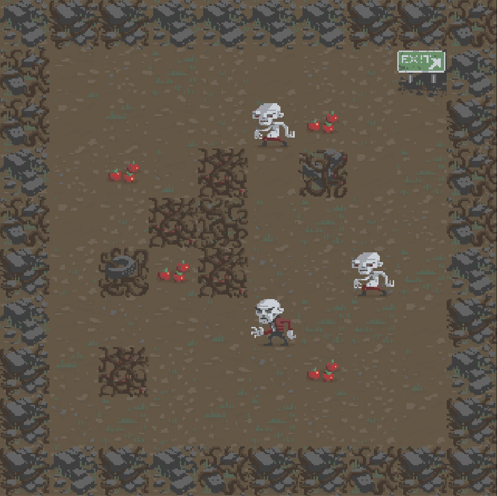

# Rogue game
Learning how to make a 2D Roguelike game. The project will contain procedural tile based levels, implement turn based movement, add a hunger system, audio and mobile touch controls.

## The game so far
